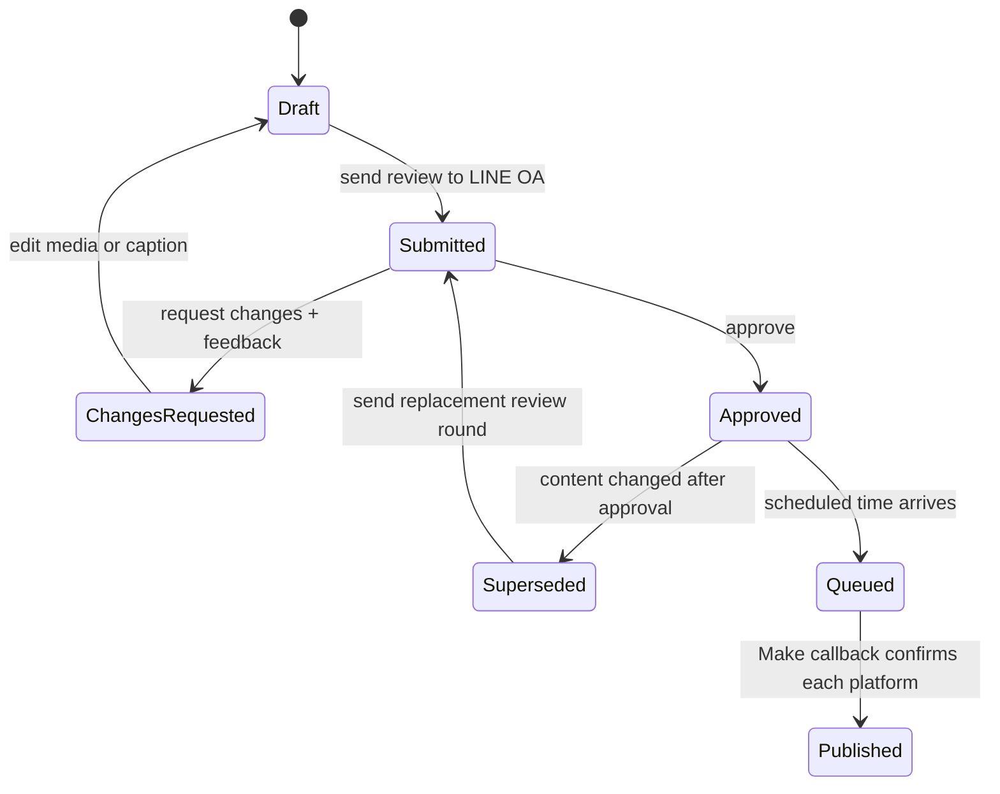

# LINE OA Review Loop and Scheduled Publishing — Design

## Goal

Add a review loop for each content item. A team member uploads a video or image and its caption in the dashboard, sends an immutable review round to the internal LINE Official Account, receives either approval or revision feedback from any account follower, fixes the content when necessary, and submits another round. Only the most recently approved round is eligible for Make to publish at the content's already-configured Thailand date and time.

## Confirmed product rules

- The LINE Official Account is a private internal team account. Every person who has added it can see review notifications and may approve or request changes.
- Every review submission, including every resubmission after a correction, sends a new LINE notification.
- A reviewer can approve, request changes, or open the work in the dashboard from the LINE message.
- A request for changes includes free-text feedback. The dashboard imports that feedback into a dedicated **งานต้องแก้** page.
- Both the uploaded media and the caption are reviewed. Either can be corrected and resubmitted.
- Approval does not publish immediately. It changes the content to **พร้อมโพสต์** and waits for its calendar date and time.
- Google Drive stores the original media. The whole Drive folder is never public.
- The production board remains linked to the review lifecycle: **รอตรวจ**, **ต้องแก้**, **พร้อมโพสต์**, **กำลังส่ง**, and **เผยแพร่แล้ว**.
- The dashboard records who took each review action and when.
- Existing Make callbacks remain the sole source of a confirmed social post URL and **เผยแพร่แล้ว** status.

## Review lifecycle

Each submission is an immutable **review round**. It captures the exact media file reference, caption, content revision, scheduled publication time, and review message identifier. Editing media or caption after a round is submitted creates a new content revision. The previous round becomes `superseded`; an approval of it cannot authorise the altered work.

The first valid decision wins atomically. Later button presses or keywords receive an acknowledgement that the round is already decided and create an audit event without changing the decision.

## Data model

The shared server-side store adds these records in addition to the existing content, publication, and Make job tables.

### `review_rounds`

- `id`: opaque review round identifier, shown in messages as `REV-…`
- `content_id`, `content_revision`, `round_number`
- `status`: `draft | submitted | changes_requested | approved | superseded | queued | completed`
- `media_snapshot`: ordered Drive file IDs, immutable asset IDs, type, size, and preview reference
- `caption_snapshot`: caption text that was reviewed
- `scheduled_at`: timezone-normalised publication instant copied from the calendar
- `line_message_reference`: delivery identifier when available
- `submitted_at`, `approved_at`, `superseded_at`
- `decided_by_line_user_id`, `decided_by_display_name`

### `review_events`

Append-only audit rows containing `round_id`, action (`submitted`, `approved`, `changes_requested`, `feedback_added`, `resubmitted`, `make_queued`), actor identity, sanitized note, and timestamp. The dashboard derives its history view from these rows.

### `review_feedback`

Each change request belongs to a review round and contains the reviewer identity, feedback text, and timestamp. The next resubmission keeps the old feedback visible as history but has no unresolved feedback of its own.

Media uses private Google Drive objects. The application stores Drive file IDs and verified metadata, never a permanent public sharing URL.

## Dashboard experience

### Content editor

Below media and caption, show **ส่งตรวจผ่าน LINE OA**. It displays the latest round status, preview, reviewed caption, review date, reviewer, and a **ส่งตรวจใน LINE** button. The button is disabled until the item has media, caption, valid calendar schedule, and a configured LINE/Drive connection.

Sending creates a new immutable round and changes the production status to **รอตรวจ**. The dashboard confirms that a LINE notification was accepted, but never calls the work approved until a validated callback has been processed.

### งานต้องแก้

Add a navigation page named **งานต้องแก้**. It lists only content with the current round in `changes_requested`, ordered by the latest feedback time. A card shows the current media preview, caption snapshot, every feedback message, reviewer name, time, and a direct edit button. The edit view includes **ส่งตรวจใหม่**; it creates the next round and notifies LINE OA again.

### Production board

- **รอตรวจ** cards open the current review history and indicate when LINE was notified.
- **ต้องแก้** cards show the newest feedback excerpt and open the repair view.
- **พร้อมโพสต์** cards show the approved-round number and the scheduled local time. Their direct status dropdown cannot bypass the approval lifecycle.
- **กำลังส่ง** and **เผยแพร่แล้ว** retain the existing Make result and per-platform links.

## LINE OA interaction

The system uses a LINE Flex message with a media preview, content title, caption excerpt, review-round identifier, and three actions:

1. **ผ่าน** sends a signed postback containing the review-round ID and sets the round to `approved`.
2. **ไม่ผ่าน / ส่งบรีฟแก้** sends a signed postback which places the round in a pending-feedback state. The OA replies asking the reviewer to type the correction note. The next text message from that reviewer is stored as feedback and changes the round to `changes_requested`.
3. **เปิดงานในเว็บ** opens the authenticated dashboard directly at that round.

Text commands are also supported for practical team use:

- `ผ่าน REV-123`
- `ไม่ผ่าน REV-123 <รายละเอียดที่ต้องแก้>`

Buttons are the default because they bind an action to one exact round and prevent ambiguous approvals in a busy chat. Every webhook request must pass LINE's `x-line-signature` verification before it is processed. LINE may redeliver events; the webhook event ID and round decision are both idempotent keys.

LINE video messages need a direct HTTPS MP4 URL and preview image; images likewise need HTTPS source and preview URLs. The backend therefore issues a narrow, temporary delivery URL for the exact Drive object instead of exposing the Drive folder or relying on a Drive Preview page. LINE's current documented limits are MP4 up to 200 MB for video and JPEG/PNG images up to 10 MB. [Messaging API reference](https://developers.line.biz/en/reference/messaging-api/nojs/) and [receiving webhook events](https://developers.line.biz/en/docs/messaging-api/receiving-messages/) define these requirements.

## Google Drive and Make integration

1. The dashboard requests an authenticated server upload session.
2. The browser uploads the file to the designated private Drive folder through the server or a signed upload path.
3. The server validates type, byte size, and generated preview before a review round can be sent.
4. The server creates a short-lived delivery route for LINE and Make. It checks authorization and streams only the matching Drive file; it is not a reusable Drive-folder link.
5. After the current round is approved and its scheduled time arrives, the existing publish queue sends the reviewed media snapshot, caption snapshot, round ID, publication IDs, and idempotency key to Make.
6. Make routes to Facebook, Instagram, and TikTok according to the existing publication rules, then calls the existing authenticated publish-result endpoint per platform.

If Make receives an old review round, mismatched content revision, expired delivery URL, or duplicate idempotency key, the server rejects it. A new round must be approved before a changed asset can be scheduled again.

## Secret and configuration boundary

No client code, Git commit, browser storage, or browser form receives secret values. The implementation only refers to these server-side configuration names:

- `LINE_CHANNEL_SECRET`
- `LINE_CHANNEL_ACCESS_TOKEN`
- `LINE_REVIEW_WEBHOOK_SECRET`
- Google Drive service or OAuth configuration managed by the deployment platform
- existing `MAKE_PUBLISH_WEBHOOK` and Make callback configuration

The team enters those values into the hosting platform's secret settings. The implementation may report whether a named configuration is present, but never reads, copies, logs, or displays a value from `.env`.

## Failure handling

- Drive upload failure leaves the content in draft and does not send LINE.
- A media item that cannot produce a valid temporary delivery URL stays in draft with an actionable error.
- LINE notification failure records a failed delivery event and permits a safe retry without creating another round.
- A reviewer who types feedback without an active pending-feedback round receives a message asking for the `REV-…` identifier.
- A callback with an invalid LINE signature, stale round, duplicate event, or malformed decision does not change content state.
- Make failure marks only the affected platform publication as failed; the approved review round and other platforms retain their correct states.
- The system never treats a Make acceptance response as a successful published post. Only the current provider callback with an HTTPS post URL marks a platform published.

## Tests and acceptance criteria

The feature is complete when automated tests and a browser check demonstrate that:

1. A media-and-caption snapshot creates one review round and a LINE send job.
2. A valid LINE approval makes only that exact round eligible to publish at its configured time.
3. A valid rejection stores reviewer feedback and exposes the item on **งานต้องแก้**.
4. Resubmission produces a new LINE notification and cannot be approved by a button or text command from the old round.
5. Simultaneous or duplicate LINE decisions create at most one accepted decision.
6. Editing approved media or caption supersedes the old round and removes publish eligibility until a new approval.
7. Unauthorized, incorrectly signed, stale, and malformed LINE callbacks are rejected.
8. A successful Make callback continues to store only canonical HTTPS platform links and preserves the existing published-tracking rules.
